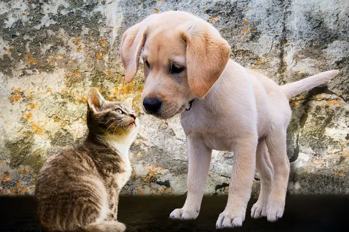

# Clasificador de Mascotas

*Jairo Andrades Bueno*

Aplicación hecha en Streamlit que carga un modelo previamente entrenado (RandomForestClassifier) y clasifica mascotas en función del peso, la altura, el color de ojos y el largo del pelo.

* Enlace a la web desplegada: <https://classipet.streamlit.app/>
